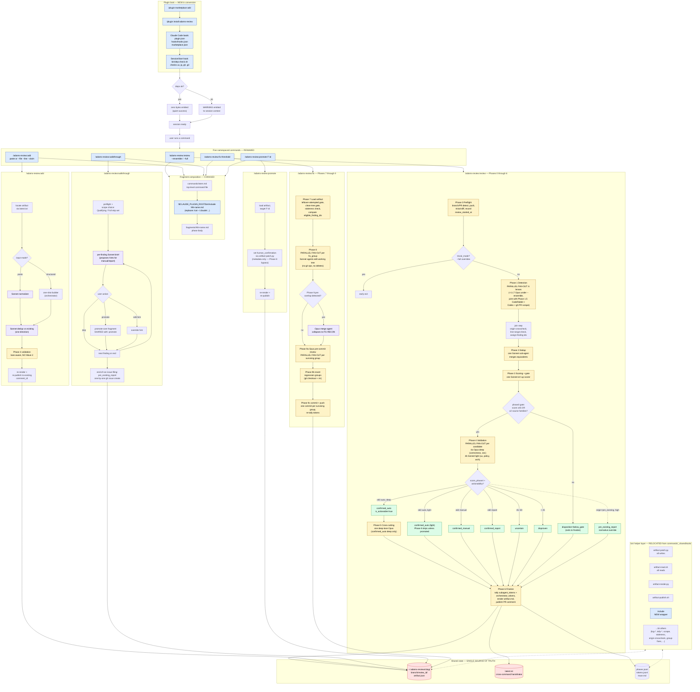
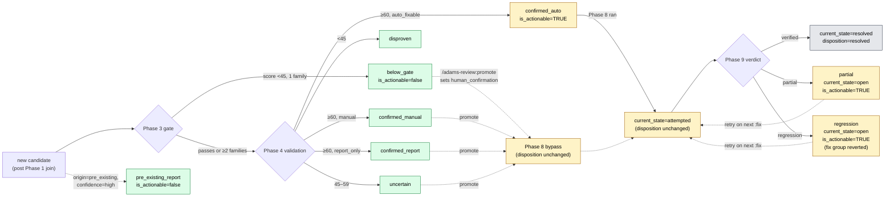
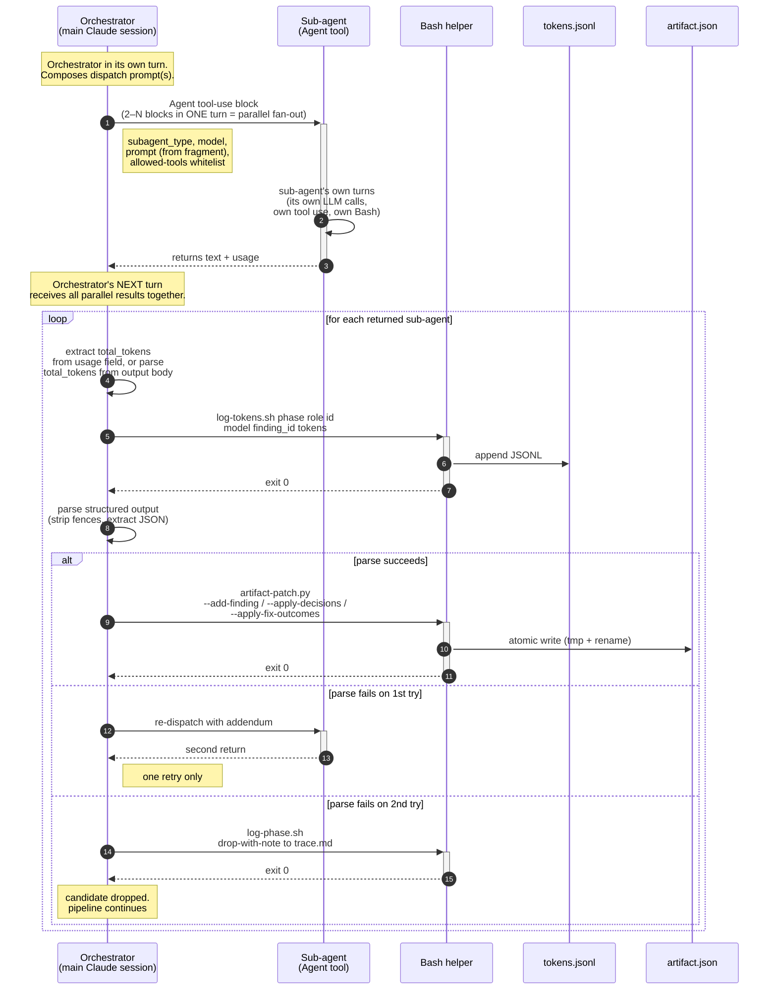

# Plugin conversion — flow visualization

Visual aid for reviewing `adams-review`'s architecture in its post-conversion
(plugin) shape. Four diagrams, each self-contained for pasting into
<https://mermaid.live>. Read alongside `plugin-conversion-execution.md` and
`plugin-conversion.md`.

The conversion is a packaging change, not a behavior change — the runtime
pipeline is identical. The blue-tinted nodes in the first diagram are what's
new or renamed; everything else is unchanged from the current slash-command
shape.

---

## 1. End-to-end flow (post-conversion)

---

## 2. Finding disposition state machine

Disposition is the routing key (filters + reports read it). `current_state`
is the lifecycle phase. Both live on every finding.

---

## 3. Sub-agent dispatch lifecycle (one cycle)

Same shape every time the orchestrator hands work to a sub-agent — Phase 1,
Phase 4, Phase 8, walkthrough briefer, etc.

Notes on this lifecycle:

- **Fan-out is a turn-boundary property.** "Multiple Agent blocks in one
  orchestrator turn" = parallel. Separate turns = serial.
- **Token logging fires before parse.** Every dispatched sub-agent's cost is
  recorded even when its output fails to parse (§24.4 invariant).
- **`orchestrator_tokens` vs `subagent_tokens` captures the split.**
  `subagent_tokens` rolls up `tokens.jsonl` (steps 5–6 above).
  `orchestrator_tokens` rolls up main-session per-turn usage (the work in
  steps 1, 2, 7, 8, 10, 11). Non-overlapping by construction.

---

## 4. Actor map — who does what per phase

### `/adams-review:review` (Phases 0–6)

| Phase | Orchestrator turns do | Sub-agents dispatched | Helpers called via Bash |
|---|---|---|---|
| **0 Preflight** | sequencing, AskUserQuestion on dirty-tree / prior-artifact | *none* | `repo-slug.sh`, `claude-md-paths.sh`, `gh`, `git` |
| **1 Detection** | composes parallel fan-out; aggregates returns | **6 lenses** (L1 Haiku, L2 Opus, L3–L6 Sonnet); +**L7 Opus** under `--ensemble`; +**Phase 1.5 normalizer Sonnet** under `--ensemble`; joint fan-out also dispatches `codex:codex-rescue` + `coderabbit:code-reviewer` | `external-scrape.sh` (Bash, not sub-agent), `comment-freshness.sh`, `origin-crosscheck.sh`, `line-range-check.sh`, `assign-finding-ids.sh`, `log-tokens.sh`, `artifact-patch.py --add-finding` |
| **2 Dedup** | composes one dispatch | **1 Sonnet** | `log-tokens.sh`, `artifact-patch.py --apply-decisions` |
| **3 Scoring gate** | composes one dispatch | **1 Sonnet** scorer | `log-tokens.sh`, `artifact-patch.py --apply-decisions` |
| **4 Validation** | parallel fan-out per candidate | **per candidate: Opus (deep) OR Sonnet (light)** | `log-tokens.sh`, `artifact-patch.py --apply-decisions` |
| **5 Cross-cutting** | composes one dispatch | **1 Opus** | `log-tokens.sh`, `artifact-patch.py` |
| **6 Finalize** | sequencing, PR comment POST | *none* | `tally-subagent-tokens.sh`, `orchestrator-tokens.sh`, `artifact-render.py`, `artifact-publish.sh` |

### `/adams-review:fix` (Phases 7–9)

| Phase | Orchestrator turns do | Sub-agents dispatched | Helpers called |
|---|---|---|---|
| **7 Load** | gate checks, eligibility filter | *none* | `artifact-read.sh`, `staleness.sh`, `prior-fix-diff.sh`, `group-fixes.py` |
| **8 Apply** | parallel fan-out per `fix_group` | **1 Sonnet per fix_group** (edits working tree, no git) | `log-tokens.sh`, `artifact-patch.py --apply-fix-start` |
| **9.pre** | `git status --porcelain` overlap scan | **1 Opus merge agent** iff overlap | `git` |
| **9a Post-fix review** | parallel fan-out per surviving group | **1 Opus per group** | `log-tokens.sh` |
| **9b Revert** | `git checkout` + `rm` on regression groups | *none* | `git` |
| **9c Commit + push** | one commit per surviving group | *none* | `git`, `tally-subagent-tokens.sh`, `orchestrator-tokens.sh`, `artifact-patch.py --apply-fix-outcomes`, `artifact-render.py`, `artifact-publish.sh` |

### Other commands

| Command | Sub-agents dispatched | Notable orchestrator work |
|---|---|---|
| **`/adams-review:add`** | **1 Sonnet** normalizer (paste mode only); **1 Sonnet** dedup; **1 Opus or Sonnet** per candidate validation (lane-aware, no Wave 2) | locates artifact via `latest.txt`, re-publishes to existing `comment_id` |
| **`/adams-review:walkthrough`** | **1 Sonnet** briefer per finding (serial loop, *not* a fan-out) | preflight scope choice via AskUserQuestion; per-finding user action via AskUserQuestion; issue-filing loop drafts in-orchestrator + `gh issue create` |
| **`/adams-review:promote`** | *none* | pure metadata write via `artifact-patch.py`, then re-render + re-publish |

---

## 5. Worth reconsidering before we execute the conversion

The plugin conversion is a packaging change. But packaging changes force a
re-walk of the architecture, and if anything here is going to change,
*before* is cheaper than *after*.

### Structural — changing is costlier post-conversion

1. **Five top-level commands vs. one command with subcommands.** Plugin
   namespacing (D18) gives users `/adams-review:review`, `/adams-review:fix`,
   etc. — five discrete command files under the hood. A single
   `/adams-review` entry with subcommand dispatch would be more conventional
   CLI shape. Trade-off: one entry is cleaner for docs + discovery; five is
   what Claude Code natively models (each with its own frontmatter
   `allowed-tools`, `argument-hint`, `description`). Stick with five unless
   you want AskUserQuestion-style discovery inside one command.

2. **Fragment count (14).** Stage 4 fragment-shrink was deferred. The
   conversion moves fragments from `commands/_shared/` to `fragments/` but
   doesn't consolidate them. If you want to collapse (e.g., merge
   `04-scoring-gate.md` into `03-dedup.md`, or inline `lens-*-reference.md`
   into `01-detection.md`), doing it pre-conversion avoids re-doing the path
   rewrites. Recommendation: keep Stage 4 deferred — fragment boundaries map
   to DESIGN phases; collapsing churns every `!include` line. Do it as a
   separate focused task later.

3. **`bin/include` wrapper vs. inlining fragments.** The plan keeps
   composition. The alternative is cat-the-fragment into each command file
   at build time (pre-commit hook or `make` target) — no runtime wrapper,
   no `${CLAUDE_PLUGIN_ROOT}` substitution path. Trade-off: inline-at-build
   produces much larger committed command files and makes cross-command
   fragment reuse (`promote-core.md`, lens references) painful. The wrapper
   is right, but now is the moment to disagree.

4. **Helper layout flat under `bin/`.** 20 scripts directly under `bin/`.
   You could split into `bin/readers/`, `bin/writers/`, `bin/utilities/`
   (mirroring the helper index in CLAUDE.md). Trade-off: subdirs mean longer
   `allowed-tools` paths and a less-flat discovery surface via `ls bin/`.
   Keep flat unless you're getting lost.

### Behavioral — architectural asymmetries worth a sanity check

5. **Light-lane asymmetry.** Phase 4b light-lane `confirmed_auto` findings
   are excluded from Phase 8 by the lane filter, and
   `/adams-review:walkthrough` exists specifically to close that gap. Most
   confusing shape in the pipeline. If you've gained confidence in Phase
   4b's judgment, you could lift the filter — but that's a behavior change,
   not a conversion change.

6. **`latest.txt` as the cross-command handshake.** Both `:add` and `:fix`
   resolve the target artifact by reading `latest.txt` (one line, one path).
   Failure mode: user ran `:review` in a different branch between commands
   → `latest.txt` points at the wrong review. Alternative: require
   `--review-id` on lifecycle commands. Recommendation: leave it —
   personal-use tool, `latest.txt` is doing its job.

7. **SessionStart hook scope.** Currently only runs `dep-check.sh`. Could
   also default `ADAMS_REVIEW_REVIEWS_ROOT`, warm a `gh auth status` check,
   or precompute `repo_slug`. Plan keeps it minimal because hook output
   injects into session context and burns tokens every turn. Recommendation:
   minimal is right. Anything environmental that can live in a Python
   helper should live there.

### Plugin-era opportunities not taken (and why that's OK)

8. **`codex:codex-rescue` and `coderabbit:code-reviewer` as first-class
   plugin sub-agents.** Ensemble mode already dispatches both — post-
   conversion they can lean on plugin-native `subagent_type` rather than
   shell-out. Plan already uses them this way. Keep as-is.

9. **PostToolUse hook for `attempted`-never-committed detection.** Currently
   Phase 7 detects leftover `attempted` findings and hard-aborts. A
   PostToolUse hook on `Bash(git commit:*)` could catch the gap earlier.
   Overkill for personal use. The current gate works.

### Cross-platform caveats to remember during execution

10. **Git Bash's BSD/GNU divergence surface is larger than one line in
    Out-of-scope.** Your `mktemp -t` caveat is documented. Also worth
    pre-checking: `date -u -d`, `stat --format`, `sed -i ''` (mac) vs
    `sed -i` (gnu), `readlink -f`. Grep helpers for these before Phase 4's
    "scripts run unmodified under Git Bash" assertion is tested.
